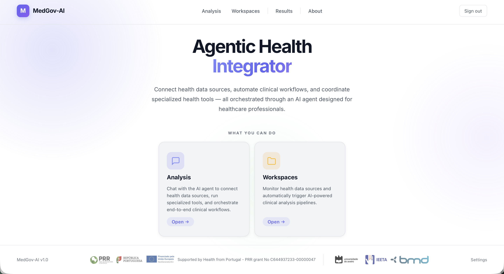
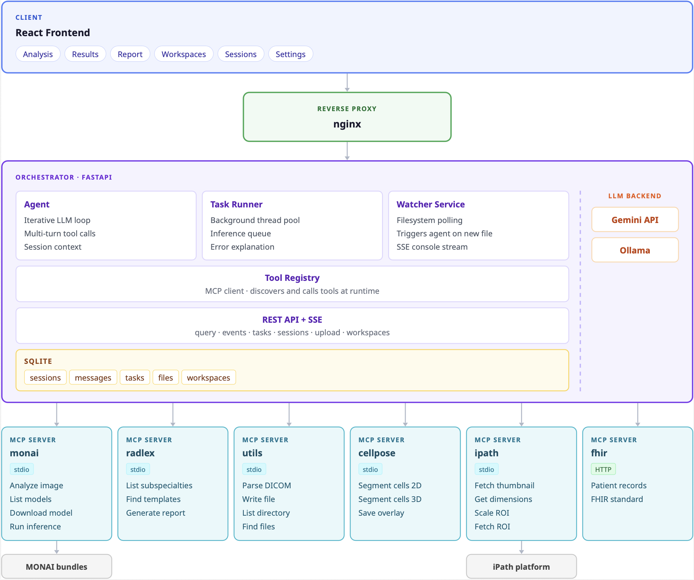

# MedGov-AI



**MedGov-AI** is an agentic AI platform for healthcare. Describe a clinical goal in plain language and the agent plans and executes the full workflow on its own — from medical image analysis and cell segmentation to structured clinical reports and FHIR resource creation.

The agent connects to specialised medical AI tools through **[MCP (Model Context Protocol)](https://modelcontextprotocol.io)**, an open standard for linking AI agents to external services. Each capability runs in its own isolated server; the orchestrator decides which tools to call and in what order.

## Demo

[](https://youtu.be/PEgMOrTM5D4)

---

## Contents

- [Features](#features)
- [Architecture](#architecture)
- [Prerequisites](#prerequisites)
- [Quick start](#quick-start)
- [Documentation](#documentation)
- [Tech stack](#tech-stack)
- [Acknowledgements](#acknowledgements)

---

## Features

- **Autonomous analysis** — describe a clinical goal; the agent selects tools, runs inference, and delivers a structured report without manual configuration
- **Radiology** — volumetric organ segmentation on CT/MRI via MONAI pre-trained model bundles; structured RadLex/RadReport reports
- **Pathology** — cell detection and counting on whole-slide image ROIs via Cellpose v4
- **Workspace monitoring** — register a directory; when DICOM files arrive the agent analyses them automatically
- **Skills** — plain-text clinical workflow protocols that guide the agent through domain-specific sequences (DICOM analysis, WSI tumour detection, clinical reports)
- **iPath integration** — WSI thumbnail fetch, high-resolution ROI extraction, and DICOM retrieval from iPath/Dicoogle
- **FHIR integration** — write clinical findings as FHIR R4 resources (Patient, Observation) to a connected FHIR server
- **Background tasks** — long-running inference jobs run in the background with real-time progress streamed to the UI via SSE
- **Debug / confirmation mode** — step through each tool call with explicit user approval before execution
- **Per-user tool settings** — enable or disable any tool per user account via the UI

---

## Architecture



The system has three layers:

| Layer | Technology | Port |
|---|---|---|
| Frontend | React 18 + Vite | 5173 (dev) / 80 (Docker) |
| Orchestrator (backend) | FastAPI + Python 3.12 | 5001 |
| MCP servers | Isolated Python services (stdio) | — |

---

## Prerequisites

### Docker deployment

| Requirement | Version | Notes |
|---|---|---|
| Docker | 24+ | [Install Docker](https://docs.docker.com/get-docker/) |
| Docker Compose | v2 (plugin) | Included with Docker Desktop |
| Gemini API key | — | Free at [aistudio.google.com](https://aistudio.google.com/app/apikey) — **or** a local Ollama instance |
| NVIDIA GPU + Container Toolkit | — | Optional; CPU fallback is automatic. See [RUN.md](RUN.md) for GPU setup. |

### Local development

| Requirement | Version | Notes |
|---|---|---|
| Python | 3.12 (exactly) | `python3 --version` to check |
| Node.js | 18+ | `node --version` to check |
| Gemini API key or Ollama | — | See above |

---

## Quick start

**Requirements:** Docker and Docker Compose — or Python 3.12 and Node.js 18+ for local development. A Gemini API key (free at [aistudio.google.com](https://aistudio.google.com/app/apikey)) or a local Ollama instance.

**1. Clone the repository**

```bash
git clone https://github.com/BMDSoftware/MedGov-AI-MCP.git
cd MedGov-AI-MCP
```

**2. Configure the environment**

```bash
cp orchestrator/.env.example orchestrator/.env
```

Open `orchestrator/.env` and fill in the required values: `JWT_SECRET_KEY`, `GEMINI_API_KEY`, and `LLM_BACKEND`. For local development also set `APP_ROOT` to the absolute path of the repo root.

**3. Run**

```bash
# Docker — CPU (recommended, works on any machine)
docker compose up --build

# Local development (sets up all venvs and starts backend + frontend)
./run.sh
```

**4. Open the app and register an account**

No default account is created. Open the UI and click **Register**.

| Service | Docker | Local dev |
|---|---|---|
| UI | http://localhost | http://localhost:5173 |
| API | http://localhost:5001 | http://localhost:5001 |
| API docs | http://localhost:5001/docs | http://localhost:5001/docs |

For GPU Docker setup, manual installation, and all configuration options see [RUN.md](RUN.md).

---

## Documentation

| Document | Contents |
|---|---|
| [docs/agent.md](docs/agent.md) | Agent architecture, execution loop, session modes, STM, debug mode, database schema, adding MCP servers |
| [docs/tools.md](docs/tools.md) | Full tool reference for every MCP server and built-in tool |
| [docs/skills.md](docs/skills.md) | What skills are, how they work, built-in skills, and how to write your own |
| [RUN.md](RUN.md) | Manual local setup, Docker GPU deployment, and full environment variable reference |

---

## Tech stack

| Layer | Technology |
|---|---|
| Frontend | React 18, Vite |
| Backend | FastAPI, Python 3.12, SQLite (WAL journaling) |
| Agent LLM | Gemini 2.5 Flash (cloud) or Ollama (local) |
| Tool protocol | Model Context Protocol — stdio and HTTP transports |
| Medical imaging | MONAI, pydicom |
| Cell segmentation | Cellpose v4 (cpsam / SAM models) |
| Radiology reporting | RSNA RadReport templates (RadLex) |
| Authentication | JWT |
| Containerisation | Docker Compose (CPU and GPU profiles) |

---

## Acknowledgements

This work has received support from the "Health from Portugal - Agenda Mobilizadora para a Inovação Empresarial" project, funded by Plano de Recuperação e Resiliência português under grant agreement No C644937233-00000047.

