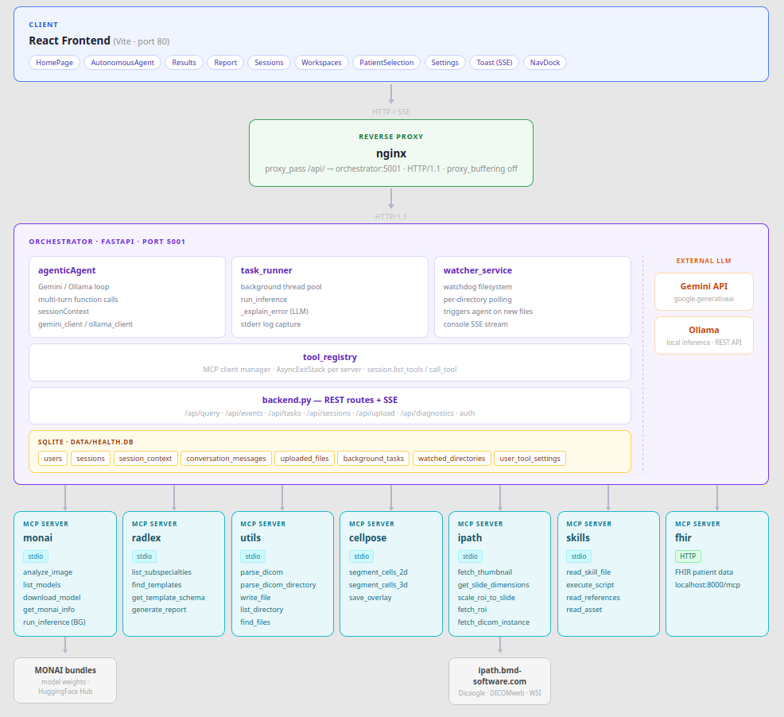
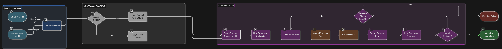

# Agent

## Purpose

The agent is the core orchestrator of MedGov-AI. It uses an LLM (Gemini or Ollama) as its reasoning engine, deciding which tools to call and in what order to fulfil a clinical goal. It does not spawn sub-agents — all decisions are made by a single `AgenticAgent` instance.

---

## Architecture



The agent is composed of focused mixins assembled into a single class in [`orchestrator/agent/core.py`](../orchestrator/agent/core.py):

| Mixin | Responsibility |
|---|---|
| `ToolManagementMixin` | Dynamic tool discovery and enable/disable |
| `SessionMixin` | Patient context and session persistence |
| `SkillsMixin` | Skill metadata loading at startup |
| `ConfirmationMixin` | User approval flow in debug mode |
| `ExecutionMixin` | Core agentic loop (`execute_task`) |
| `ResultFormattingMixin` | Human-readable response formatting |
| `STMMixin` | Short-term memory state for stateless LLM mode |

---

## Agent modes

### Analysis Agent (default)

The user sends a natural language query, optionally with uploaded files. The agent selects tools, executes them iteratively, and returns a response. This is the interactive, chatbot-style mode.

### Autonomous Agent

The agent executes a full workflow without user interaction. It can be triggered in two ways: via workspace monitoring when new files arrive in a watched directory, or directly by switching to autonomous mode via the UI or `/api/change-agent-type` and submitting a goal. In both cases the agent selects and executes tools on its own until the goal is achieved.

---

## Execution loop

The agent workflow is an iterative loop, up to 20 iterations by default:

1. A goal is set — by the user (analysis mode) or by the workspace watcher (autonomous mode).
2. The agent sends the goal and session context to the LLM, which selects the next tool to call.
3. The tool executes via `ToolRegistry` and returns a result.
4. The result is fed back to the LLM, which evaluates progress and decides the next step.
5. The loop ends when the agent calls `goal_achieved` or the iteration limit is reached.



---

## Session and context

The agent operates in one of two LLM modes:

**Stateful (default):** The full conversation history is maintained in the LLM's chat session. Context is preserved automatically across all iterations — no information is lost between tool calls. Token usage grows with session length.

**Stateless:** Each LLM call is independent. The agent uses the STM subsystem (see below) to pass state explicitly between iterations via injected prompt context. Stateless mode is only supported with Gemini — Ollama always runs in stateful mode.

When a user returns to a previous session, the history of tool calls and their summarised results is restored from the database. Only summaries are restored, not the raw tool outputs.

---

## Short-term memory (STM)

The STM subsystem is used in stateless mode only. It manages an `AgentState` object that is injected into the prompt on each iteration, giving the stateless LLM continuity between calls.

**Files:** `orchestrator/agent/stm/mixin.py`, `manager.py`, `state.py`, `tools.py`

**AgentState structure:**
- `task` — the original goal
- `completed_steps` — summaries of steps taken so far
- `current_objective` — the declared next working step
- `artifacts` — file paths discovered during execution
- `important_facts` — key/value facts the agent has persisted

**STM tools** (available only in stateless mode):
- `update_agent_notes(key, value)` — persists a fact across iterations
- `set_next_objective(objective)` — declares the next working step

> Stateless mode with STM is functional but experimental. It does not always fulfil the objective — the agent may lose track of progress across iterations. Stateful mode (the default) produces better results for most workflows.

---

## Debug / confirmation mode

When `require_confirmation` is enabled, the agent pauses before executing each tool call and waits for explicit user approval. The pending call is exposed via `/api/pending-tool`; the user confirms via `/api/confirm-tool` or cancels via `/api/deny-tool`.

This mode is useful for auditing the agent's decisions step by step during development or in sensitive clinical workflows.

---

## Database

The agent uses a SQLite database with WAL journaling stored in `orchestrator/data/`.

| Table | Purpose |
|---|---|
| `users` | User accounts (username, email, password hash) |
| `sessions` | Session metadata and patient context |
| `session_context` | Summarised tool results per session, restored on session reload |
| `conversation_messages` | Full chat history per session |
| `uploaded_files` | Files uploaded by users with stored paths and metadata |
| `background_tasks` | Long-running task queue with status tracking (`queued → running → completed/failed`) |
| `watched_directories` | Filesystem directories registered for autonomous monitoring |
| `user_tool_settings` | Per-user tool enable/disable flags |

---

## Watcher service

The watcher service polls registered workspace directories at a fixed interval and triggers the autonomous agent when new files appear. Each watched directory has a configured prompt (the goal) and an output path. When a file arrives, the watcher submits it to the agent exactly as if the user had uploaded it in autonomous mode. Multiple workspaces can run concurrently, each with its own goal and agent instance.

Workspaces are managed via the UI Settings page or the `/api/watched-directories` endpoints.

---

## Tool settings per user

Each user has their own set of enabled/disabled tools, persisted in the `user_tool_settings` table. Disabling a tool removes it from the agent's context entirely — the LLM will not see it and cannot call it. Settings are applied at session start and can be changed via the UI or `/api/enable-tool` / `/api/disable-tool`.

---

## Task runner

Long-running operations (MONAI inference, report generation) are offloaded to a thread pool rather than blocking the API response. The agent calls `queue_task` to submit a job; the task runner executes it in the background and streams progress to the UI via SSE. Maximum concurrent workers is configurable via `TASK_MAX_WORKERS` (default: CPU count + 4, max 32).

---

## System prompt

The system prompt is defined in [`orchestrator/agent/prompts.py`](../orchestrator/agent/prompts.py). It describes the agent's capabilities, the available tools, how to invoke skills progressively, and the expected output format. Separate prompts are used for analysis and autonomous modes.

---

## Extensibility — adding MCP servers

New MCP servers can be added via the UI Settings page (no restart required) or by editing `orchestrator/mcp-config.json` and reloading via `/api/refresh-config`.

**stdio server:**
```json
{
  "mcpServers": {
    "my-server": {
      "command": "${APP_ROOT}/my-server/venv/bin/python",
      "args": ["${APP_ROOT}/my-server/server.py"],
      "transport": "stdio",
      "env": {
        "PYTHONUNBUFFERED": "1"
      }
    }
  }
}
```

**HTTP server:**
```json
{
  "mcpServers": {
    "my-server": {
      "transport": "http",
      "url": "http://localhost:9000/mcp"
    }
  }
}
```

`${APP_ROOT}` is expanded at runtime from the `APP_ROOT` environment variable.

---

## Logging

Per-session logs are written to `orchestrator/logs/` and include LLM inputs and outputs, tool calls, and tool results. Startup logs are written to `orchestrator/logs/startup.log`.
