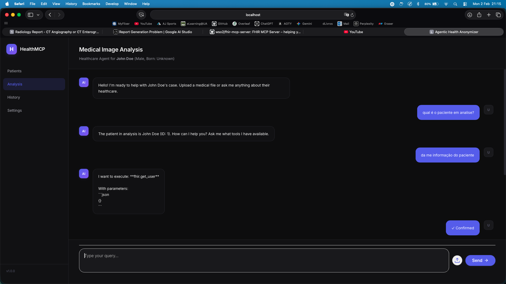

Gabriel

Today I found some test data, and proceeded to test and integrate the full workflow now with both ollama and gemini.
(Using Pydicom files to analayze)

I created a new directory test_data where I left you notes of some downloadable files.
Also in the previous day's .md I also left there some possible URL's where we could fetch some data

!!!!
TODO: Maybe we should build a dockerfile or we should reorganize to not have each env in different places, although this might go against the architecture
TODO: Also the different model choices in the backend for when one of the Gemini ones doesnt work, or at least an option to switch models
TODO: Allow severael files to be uploaded at the same time and analyzed
TODO: Need to look for a better model for local runs, and of course this will mean an heavier one

Altered the prints in ollama keeping the reasoning and inner thoughts of the AI for debug and logging purposes only and not as output for the user.

Again small changes in the frontend

Looking at the logs: the dicom parser is working but the analyze image reader isn't being called properly, also it's failing to look up element tags.

- MONAI needs pydicom as well, this should fix the parsing inability from MONAI and the reading/analyzing image
- MONAI is expecting a 3D slice since it has 3D Models, but .dcm are 2D
- The AI wasnt using the parser first, it was calling analyze image instead of parse_dicom to get the body part and modality
- Theres no context retention meaning each query is starting fresh and the AI doesnt remember the previous parse results
. With a directory full of dcm slices we could reconstruct the 3d image, maybe.

I downloaded a full dataset, this is the structure:
In the test_data folder please
The files are not .DCM but thats not a problem
Also, the config.json got submitted because I had it altered before adding to the gitignore I hope you don't mind
curl -L -o ct_dataset.zip "https://zenodo.org/record/16956/files/DICOM.zip?download=1"
- ST000000 = Study folder
- 1.2.840.1... = Study Instance UID (unique identifier)
- SE000000, SE000001, SE000002 = Series folders (different scan sequences)
- thumbs/ = preview images (PNG thumbnails)
- ctkDICOM.sql = database file (from 3D Slicer or viewer)  

Henrique

Estive a tentar ver se melhorava o report a partir do template. No entanto, não consegui grandes melhorias.
Acho que devido ao facto de não termos muita informação sobre o que foi feito, o relatório fica sempre um pouco vago.

Implementei agora uma nova funcionalidade que antes de começar a conversa com o agente, primeiro seleciona-se o paciente, e a conversa é personalizada para esse paciente.
Ainda não implementei contexto do paciente na conversa, mas já fica preparado para isso.
O que faz é entao, quando se seleciona o paciente, o backend atualiza o prompt do sistema do agente para saber que está a falar desse paciente.

Como está, ainda da para utilizar a implementacao antiga, apenas nao se seleciona nenhum paciente, e vai se direto para a pagina de analise.

O que faz é:

- lista os pacientes disponiveis, estes pacientes estao no fhir, e a atual implementacao chama o mcp e lista os 10 primeiros (como é pra teste, é suficiente por agora)
- ao selecionar um paciente, o backend atualiza o prompt do sistema do agente para incluir o paciente selecionado
- a partir daqui, a conversa com o agente é personalizada para esse paciente

Para usar é preciso entao o mcp do fhir a correr, e ter la alguns pacientes.

## Alteracoes a fazer

- Com isto, adicionar uma funcionalidade de contexto do paciente na conversa, para que o agente possa aceder a informacao do paciente durante a conversa, sabendo que pode usar o mcp do fhir, tem de se avaliar se faz sentido implementar isso agora ou não.
- passar tudo para o lado do agenticAgent, pelo que (ex. system prompt esteja do lado do agenticAgent, e nao do geminiClient ou ollamaClient), para ficar tudo mais organizado e encapsulado. Mudar apenas num sitio, e nao em varios.

Adicionei tambem um script para download de imagens medicas que meti nos links.md, ao fazer download aquilo guarda num ficheiro .tcia, e o script descomprime esse ficheiro para uma pasta. Assim ja da para fazer download de datasets de imagens medicas, de apenas um paciente, ou de varios pacientes.
Link -> Download Patient Imaging Data
