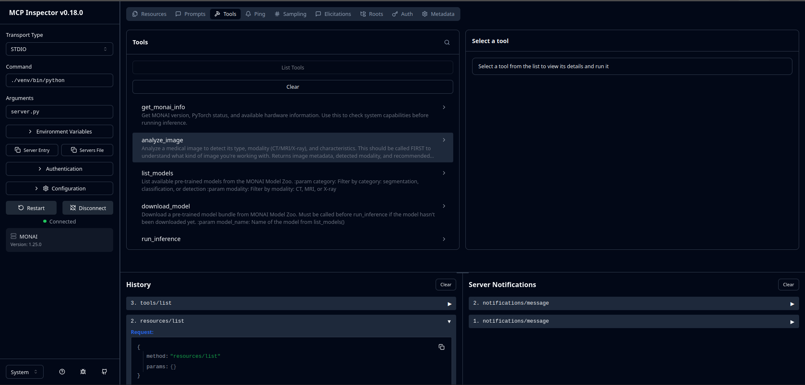
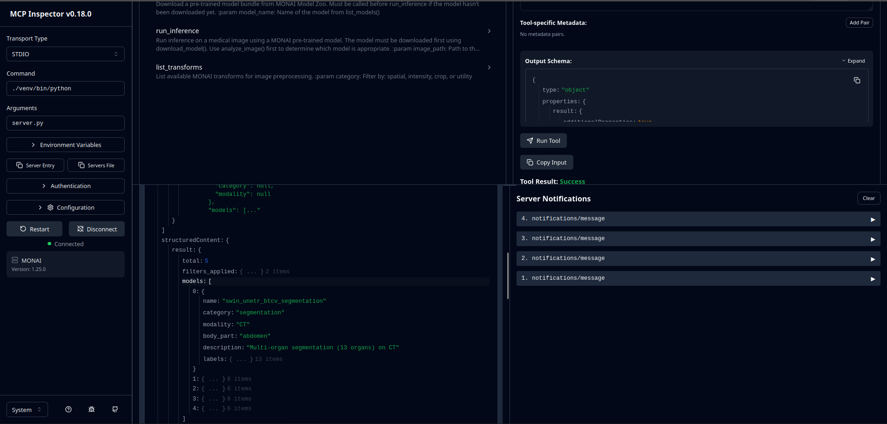

Gabriel

MCP SKD nativo para fazer o routing automatico entre agentes
O server2 usava o stdio/SSE mas nao é compativel com o cliente que temos
- Workflow feita:
Tenho uma imagem DICOM -> LLM lê tool descriptions -> load image metada -> ve resultados -> run segmentation -> gera relatorio
Assim nao rescevemos logica de routing e usamos o LLM do CLAUDE

- Criei a run inference para realmente correr o modelo MONAI como tinhamos falado
- Adicionei o MCP config.json que referiste
User: "Analisa esta imagem: /path/to/scan.dcm"

LLM chama → analyze_image(path) → Retorna: {type: "CT", body_part: "abdomen", ...}               
LLM chama → list_models(category="segmentation") → Retorna modelos disponíveis  
LLM escolhe → run_inference(path, model="swin_unetr_btcv") → Retorna segmentação 
LLM chama → list_models(category="segmentation") → Retorna modelos disponíveis
LLM gera relatório baseado nos resultados

Para testar o MCP podemos
Copiar o ficheiro config para ~/.config/claude/claude_desktop_config.json 
No caso de usar claude desktop
OU
Podemos usar *MCP inspector* 

Nao te esqueças de estar dentro do venv
**npx @modelcontextprotocol/inspector python /home/gabriel/Desktop/AgenticHealthMCP/mcp-monai/server.py**

Nao vais precisar de autenticação porque estás a correr localmente
Assim abrimos o MCP via stdio
Abrimos um browser com a interface web

Antes tinhamos 
NOSSO CODIGO -> REGISTRY (CLIENT) -> HTTP MCP SERVER
Agora temos
CLAUDE DESKTOP <- MCP stdio (standard protocol) -> MCP Servers

(Podemos entao eliminar o registry.py; client.py; workflow.py; demo.py; services.json)

Agora para testar a inferencia com imagens, tens o mcp-monai/data/download.txt
Pelo monai conseguimos tambem fazer download mas eu simplifiquei deixando lá o comando

CT/MRI 3D real (NIfTI ou DICOM) -> Devem ser os focados para o caso de uso
MedNIST é mais para provar que o pipeline funciona