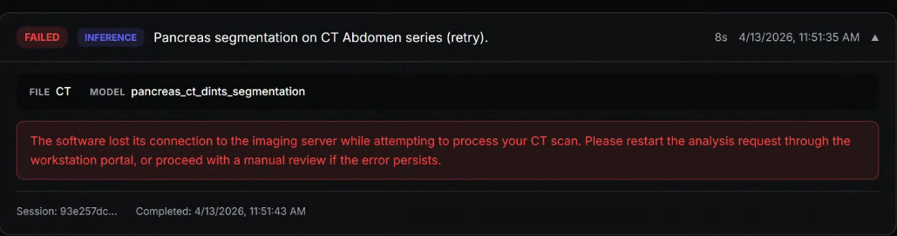
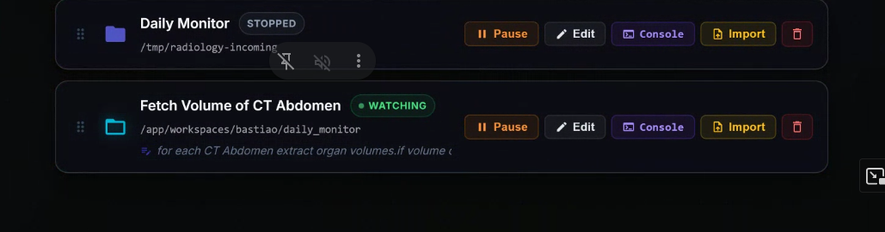

Gabriel

# Extract data via dicom web

- https://www.dicomstandard.org/using/dicomweb/retrieve-wado-rs-and-wado-uri

mcp-ipath: BMD whole slide imaging server "ipath.bmd-software.com" -> Has gigapixel pathology slides, large images that cant be loaded at once. Theyre stored as pyramids of resolutions

The 4 tools added previously use iPath /roi endpoint and not DICOMWeb.
Im asked to implement with DICOMweb support:
- get_series_instances (/pinfo endpoint to discover what resolution levels exist and their SOP)
- fetch_dicomo_intance (the dicomweb get /studies/ /series/ /instances/ to download the dicom file)

One gigapixel slide split into multiple resoultion levels. level 7 thumbnail, the instances are the same slide at different resolutions

pinfo response has all levels, each level is half than the previous one.
SO I suppose level 0 would be to run the models like cellpose, mid leevels would be to preview an image, and level 7 would be for what? small level tasks?

The workflow asked is for: download thumbnail -> llm identifies roi -> scales coordinates -> fetch high res

I need to fix the fact that I asked for instance UUID and dimensions which I can get from get_series_instances but teh agent downloaded the dicom file.

- Safeguards added (validate uid on all uids)
- Registered in mcp config
- In dockerfile cpu and gpu
- dedicated mcp server
- two tools added

# Done

- increased poll mcp tools interval
- fixed inventing paths
- chat disappearing every time i refresh the page
- messages are now restored on page load

# TODO

- Optimize speed (tools are accumulating, calls are taking longer for orchestrator to answer)
- Mount directory in docker /workspace , locally for DICOMweb
- Focus on paper
- fix notification issue
- fix error i think its OOM
- better error messages

# Meeting notes

- Corrigir erros
The message comes from the orchestrator

- Pensar num abstract
Nao tivemos muito um state of the art, foi mais ler coisas da internet, se quiseremos state of the art, precisamos de ler revistas, estudos, etc
Nova revisao de estrutura de report
Use casses dentro da seccao de resultados?
- Figuras de architetura, figuras de resultados, use cases
- O codigo tem que estar disponivel para mostrar que isto funciona e as instrucoes para repetir o use case
- fundamentacao do artigo (evidencia cientifica - determinadas tarefas teem vantagem de utilizar AI)
- Começar a escrever e documentar, parar de programar
- justificar escolhas e implementacoes
- perceber onde estao as lacunas

20 a 30 referencias

## IMPORTANT 

- Google scholar; Scite (outros sites para pesquisa de artigos)
- Scopus

- MCP em serviços de saude
- Tecnologias MCP
- MCP DICOM

MCP AI ACM | IEEE