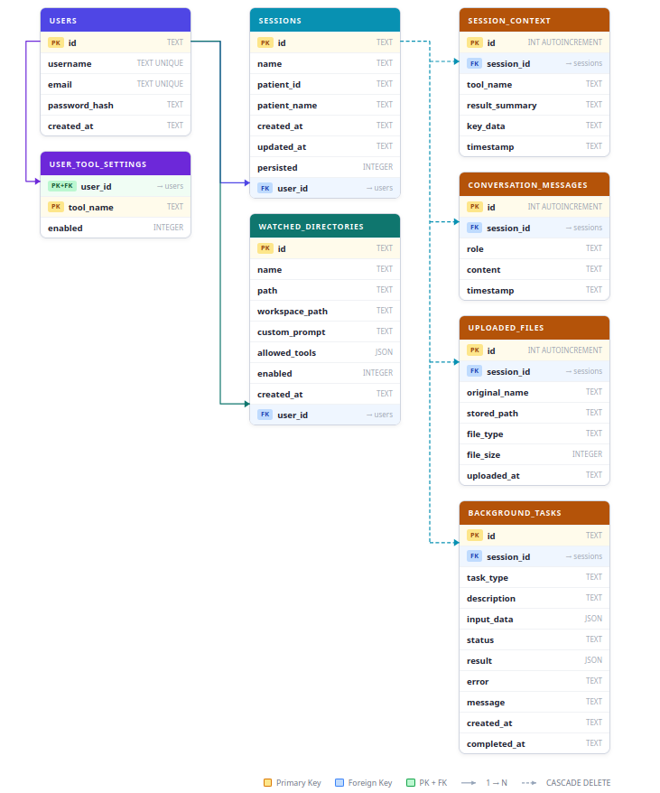

Gabriel 

Erros fixed... More tests to be conducted

# Paper

*Websites*
- arxiv.org
- pubmed.ncbi.nlm.nih.gov
- medrXiv.org
- google scholar

---

MCP directly in healthcare:

- Agentic-AI Healthcare: Multilingual, Privacy-First Framework with MCP Agents https://arxiv.org/abs/2510.02325
- MCP-AI: Protocol-Driven Intelligence Framework for Autonomous Reasoning in Healthcare https://arxiv.org/abs/2512.05365
- Enhancing Clinical Decision Support and EHR Insights through LLMs and MCP: An Open-Source MCP-FHIR Framework https://arxiv.org/abs/2506.13800 (DONE)
- EHR-MCP: Real-world Evaluation of Clinical Information Retrieval via MCP https://arxiv.org/abs/2509.15957

Agentic LLMs in radiology/medical imaging:

- Agentic Systems in Radiology: Design, Applications, Evaluation, and Challenges https://arxiv.org/abs/2510.09404
- A co-evolving agentic AI system for medical imaging analysis https://arxiv.org/html/2509.20279v1
- Medical AI Consensus: A Multi-Agent Framework for Radiology Report Generation https://arxiv.org/html/2509.17353
- How Well Can Modern LLMs Act as Agent Cores in Radiology Environments? https://arxiv.org/abs/2412.09529

# Notes

In the paper *https://arxiv.org/abs/2506.13800* (focuses on using MCP for improving narratives and documentation burdens using LLMs also) they found the exact same problem as us: "While these implementations successfully transformed complex medical data into accessible narratives, they were constrained by platform-specific dependencies, static configurations, and the need for manual prompt engineering."
They conclude MCP is an amazing step because it offers frameworks that prioritizes interoperability, reproducibility, standardized methods, declarative interfaces for accessing medical data. (Better than hardcoded API calls)
Facing challenges in clinical decision report.
They use an abstraction layer in between inputs.
They had predefined a freeform query options, for treatment options available and to sumarize medications and patient conditions.

# Architecture

# Database

# TODO

- Workflow diagrams
- Check issues for workflows
- Test the workspaces functionality
- Test teacher use cases from discord messages

# Meeting

- Pode haver situacoes em que o MCP nao é o melhor
- A seleção da localização do tumor é pelo LLM e não pelo modelo treinado pela LLM
- Limitar tamanho do patch em tamanho absoluto

- Faz sentido manter o ollama local por faz parte da arquitetura
- Foram feitos testes com 2 3 versoes de ollama mas reconhecer que com modelos melhores poderia funcionar melhor mas do ponto de visto da arquitetura da para funcionar com modelo local e api

- Solucoes area na saude semelhates, agentic ai, etc
- Github, neste momento repo é privado, estruturar o que podemos partilhar com o minimo de qualidade
- Varios prompts, o que testámos, qual foi o resultado
- Mandar PDF quando tivermos uma estrutura para o paper