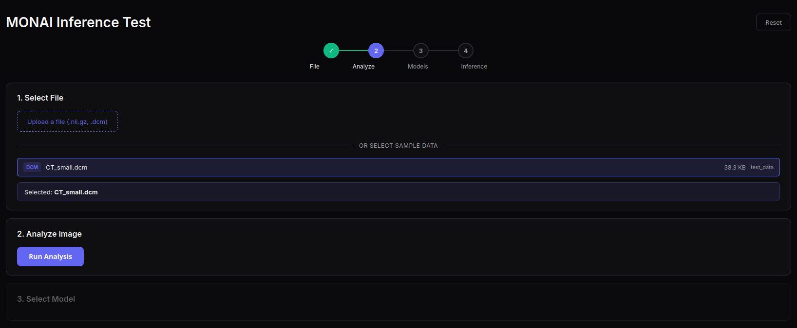

Gabriel

O get_system_prompt com o merge ficou com dois return statements, which is fine mas depende de qual é que queremos suar, mas tambem sao so system prompts, se bem que tu forças mais as skills no teu.
Eu testo o teu depois porque eu quero manter o conversational model

The LLM agent can call MONAI tools but there's no way to manually verify each step works independently. We need a dedicated test page that bypasses the agent and calls MONAI tools directly, stepping through: select file -> analyze -> pick model -> download -> run inference.

I created backend endpoints, monai/analyze monai/list_models etc, because we were calling via agent llm process query and gemini was deciding, this that I did is for testing purposes only, because of these things being high token requests, and for some reason I still cant setup the payment like you did, the page simply doesnt load, ive tried different browsers, different computers, maybe its their website, i mean its the only option right?
As i was saying, now we are bypassing the llm but on a specific frontend page that i created, and things are working, this is for testing th parsing and analyzing the model, but either way we can keep it like this if we want because it can also be a manual option in case the model is failing
                                                                                                                                                                              

(I had to change the day because I only got this to work at this time)

Fixed also some error messages that we spoke about for example when not starting fhir

Skills was also failing because server.py had the sys path insert pointing to the wrong place, idk if it was a merge error or not, but be careful with these things. You should test if it works after merging. 

FHIR fails because it's an HTTP transport server (http://localhost:8000/mcp) and nothing is running on that port. That's expected - it's an external service that needs to be started separately. 

## The frontend test page

Basically Im fetching from certain directories and the database the files, and we manually analyze and choose the model.
We have the analyze to extract the modality and bodypart as in the parser.

Because I was also trying to analyze .nii but tomorrow ill take care of this 
"Failed to analyze image: File /home/gabriel/Desktop/AgenticHealthMCP/mcp-monai/sample_data/Task09_Spleen/Task09_Spleen/imagesTr/._spleen_10.nii.gz is not a gzip file"
And Ill analyze typical dcm and not just the test image

I also fixed a logging error on an exception, code and run should be clean now

Ill also fix tomorrow when you end the backend session the big error it shows for clearance, after properly testing the files and inferences