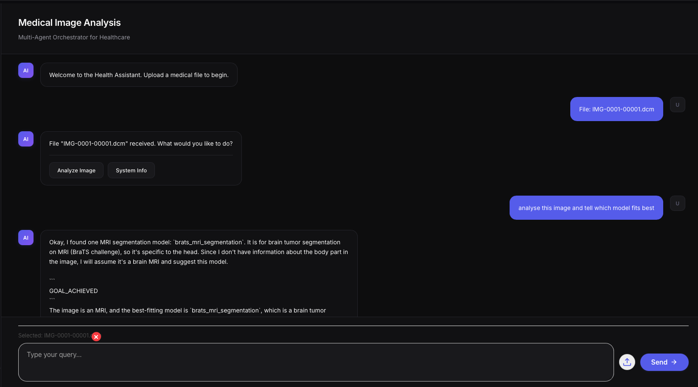
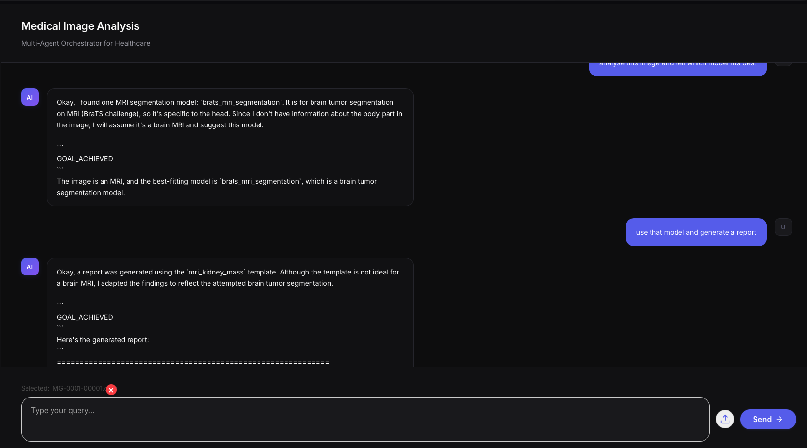
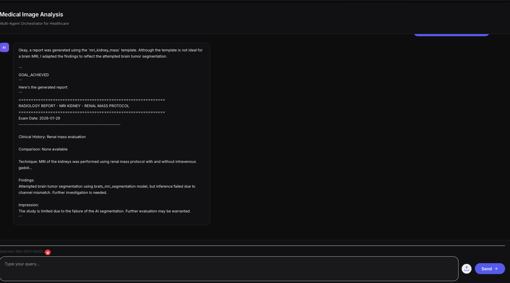

Henrique

## Alterações

mudança na interface, agora existe text box com upload de imagem, permite ao utilizador fazer queries para o agente com base na imagem carregada

remover imagem implementado, so clicar na cruz e remove imagem

Quando utilizador clica em enviar, chama api/process-query que depois chama o agente com a query e a imagem (se existir)

E alteração no gemini-client agora em modo chat, para existir contexto entre as mensagens, pelo que antes era usado generate-context que dava apenas resposta unica sem contexto, e agora é usado chat.

Imagens de exemplo de teste:

## Coisas que nao retirei mas não estão a ser usadas

- o endpoint /api/process-workflow que era usado para correr workflows predefinidas
- o analyse image e system info butoes no frontend, ainda aparecem visualmente, quando clicado chama o workflow que existia antes

## Coisas que faltam

- ollama nao mexi, acredito que ainda deve estar como generate-context, porque nao mexi
