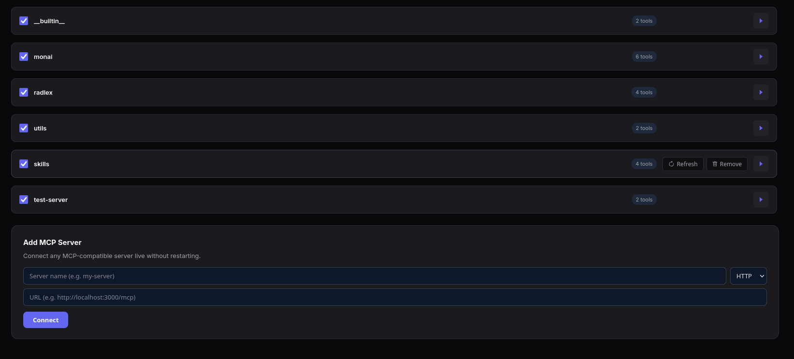
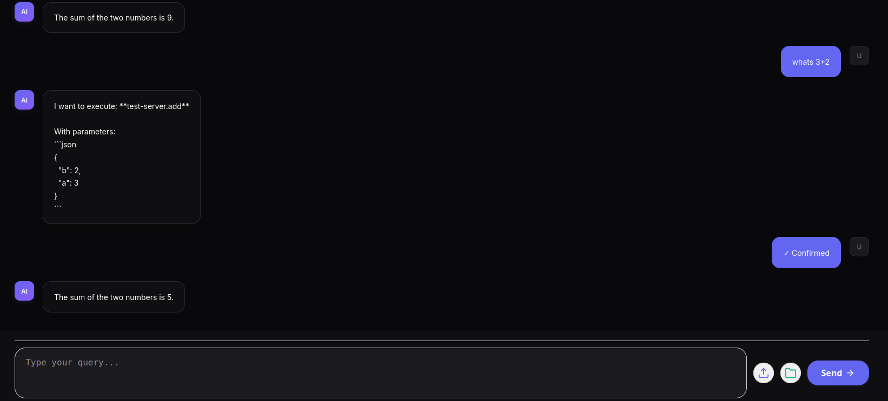

Gabriel


- Finished the mcp frontend integration (tested only for http)
- Corrected orchestrator state when turning on, off, removing or adding mcp servers or tools

(Refreshes to find new tools within the same MCP server that's already added)
First I started with a manual refresh function. But then I thought, it would be usefull even for the full background method to keep updating from time to time due to it being able to use the new tools without human intervention.

Since MCP isn't a push protocol but rather a pull, I put a pull function running every 30 seconds
If it was push or if you find a way you could make it so it pushes something whenever it gets added a new tool
(I'm also integrating a notification system in the settings tab, to say or tell the user whenever a new tool is added or removed or a new mcp server added or removed)

I don't think it's possible for us to make it so we can just "Discover" MCP servers, I think they need to be anounced or manually added
Went from manual refresh of all mcp-config setting and rediscovering, to addind a call that pulls each 30 seconds

- refresh_server_tools() in tool_registry.py
- MCP tools and server rediscovering
- mcp notifications
(Added endpoints and changed agentic function)


- notifications tab in settings
(Notification api endpoints)
(Reusing the SSE stream I had already implemented before)


- Frontend changes
- Disabled tools notification
(Notifications for, added, removed, enabled, disabled, MCP servers and tools)
New event types
Should add also if there's an error in a tool
Don't know how I could do that

- docker compose changes
Now it persists the mcp config, so when changing settings on mcp servers it doesn't persist those changes
Disabled tools were not persisting on restart

(Just decided to load all tools back up on server reset)
*Removed tool stops appearing on docker reset*
Should it? Shoudn't it? I'll correct this after


- To test the MCP http connection with a new server use mcp-test
- Start by installing the requirements and running in an venv
- Start the server.py
To add:
http://host.docker.internal:3001/mcp

------------------------------------------------


Adding a new MCP tool



Using a new tool



### TODO (Notes from Martinho)

```
Eu já meti o runner a correr, a pipeline entretanto correu mas falhou porque o env file do orchestrator não existia. Eu fui fazendo uns ajustes e já consegui pôr a correr na máquina, sugiro na pipeline:

- Fazer docker compose build depois do checkout
- Meter na pasta /opt/medgov-ai-mcp apenas o necessário para correr os serviços, que é basicamente os docker composes e uma cópia do orchestrator/.env file se ele ainda não existir
- Correr o docker compose up -d na pasta /opt/medgov-ai-mcp


Quanto ao deployment, reparei que o frontend comunica com a API do orchestrator usando o endereço localhost:5001, o que não funciona quando deployed. Para resolver isto podem, por exemplo, apenas referir-se aos paths no frontend (e.g. /api/sessions em vez de localhost:5001/api/sessions) e ter um serviço nginx que mapeia chamadas à /api para o backend e o resto para o frontend, mas vejam o que acham melhor
```


I had a config.js but it wasnt working, I need to use relative paths
The Vite proxy was also pointing to the wrong URL


Frontend components now import API_URL from the config.js file.
All API calls are not relative paths like /api/sessions.
Nginx proxies /api/ to the backend


The deploy pipeline:
Docker compose buid builds images after checkout
Copies only docker-compose.ym and docker/ to /opt/medgov-ai-mcp
Creates /opt/medgov-ai-mcp/orchestrator/.env only if it doesnt already exist, so manual edits are not overwritten
Then it docker composes up from that directory

O docker compose yml no opt/medgov-ai-mcp apenas referencia as images construidas da source
build:context
But the source code isn't copied there, only the compose file and docker folder.
The built images stay in docker's local image cache on the runner machine, so docker compose up -d uses those cached images. 