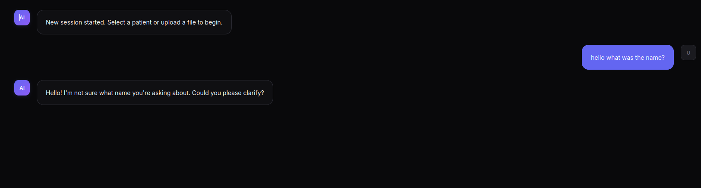
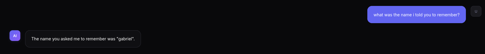

Gabriel

[7-03-2026]
[8-03-2026]

After Martinho's message I started working on some fixes:

- gemini 2.0 hardcoded, passing it to an env variable (GEMINI_MODEL) (one reason for us to not have done this before is because we were working seperately with different models and also because we were planning on implementing a more generalized logic that would allow to swap models automatically in case of running out of tokens)
- session reload breaking continuity, messages not included, just tool calls (was for optimization but ill include messages)
- Add a deploy pipeline with runs-on: self-hosted + docker-compose (he explicitly added a self-hosted runner)
- docs (procotol / specification document, markdown describing how the system works)

About the architectural design we have:
1. Patient-centric context mechanism
2. User-customizable autonomous mode prompt
3. Multi-agent scalability approach
4. External event/notification stimuli
5. MCP server management UI (add/remove, not just enable/disable)
6. Model selection via UI not just .env

----------------------------------------------------------

I put a fallback for a default model in case you dont have setup in the .env
It's falling back to 2.0 which I think its a free one

----------------------------------------------------------

Added a new table in the database for the conversation messages

database.py
- conversation_messages
- save_message() | get_messages() | clear_messages()  

backend.py
- api/process-query
- api/messages
- api/load-session

Altered some in the frontend

(its working but I found a bug, the models messages disappear after i load back the session, another bug i found is that when i discard a session it doesnt really discard it)

- When pressing discard and switch it should discard the previous session you were in
Should switch from session first 
- fixed messages not appearing from the models side
- fixed the discard and switch
- fixed database and loading another session

----------------------------------------------------------

Ill keep running the backend and frontend seperately for now, because nvidia drivers can go wrong in ubuntu and when running the inferences on docker containers I need to have the nvidia toolkit installed to bridge the gpu to the containers, instead of using them directly on the machine

or just run the cpu one
(replace in docker compose)

---------------------------------------------------------

I built the self hosted workflow docker file
It will trigger in everypush to main
Run on the repo's server, meaning the runner is tha actual machine where the app will live

## TOOD:
- EMAIL MARTINHO
- Directory analyzer
- Drag and drop
- Pseudoanaonimização
- Possibilidade de ligar MCP servers no frontend, escolher tools, scout and connect to new servers on the fly, this allows more functionalities
- Model selection in the frontend